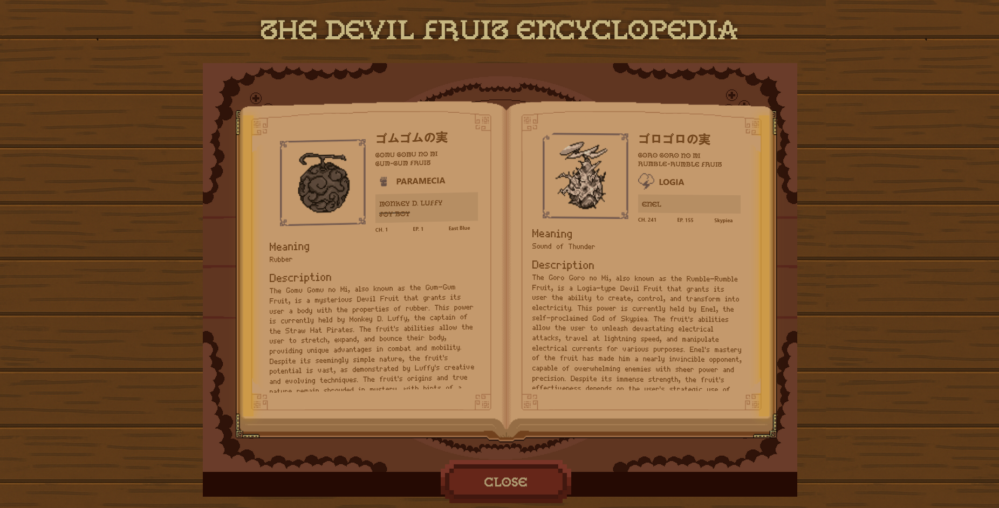
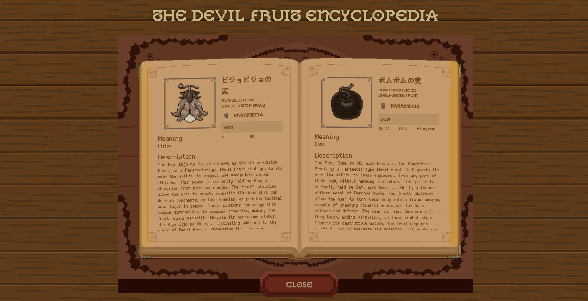
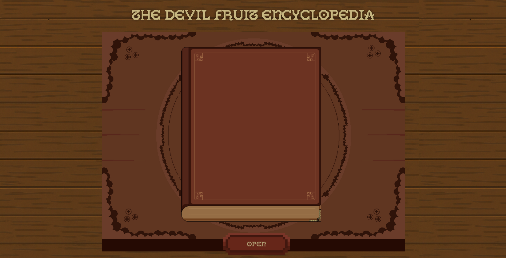

# The Devil Fruit Encyclopedia

The Devil Fruit Encyclopedia is a pixel-styled web application that serves as a comprehensive guide to the Devil Fruits from the One Piece universe. The app features a unique interactive book interface, allowing users to flip through pages and explore detailed information about each Devil Fruit.

## Features
- **Pixel Art Style**: The app embraces a pixel art aesthetic for a nostalgic and visually appealing experience.
- **Interactive Book**: Flip through pages of the encyclopedia with smooth animations.
- **API Integration**: The app fetches Devil Fruit data from a custom API.

## Previews
Here are some previews of the application:

### Screenshots

### Animations

## Technologies

- **React**
- **GSAP**
- **Vite**
- **TypeScript**
- **Axios**
- **React query**

## API
This application uses a custom API that I developed with Springboot to provide data about Devil Fruits. You can find the API repository here: [The Devil Fruit Encyclopedia API](https://github.com/ben4ali/The-Devil-Fruit-Encyclopedia-API).

## Art and Assets
- **Devil Fruits Art**: All Devil Fruit art assets were created by **ben4ali**.
- **Book Asset**: The book asset was created by **HumblePixel** and can be found on [HumblePixel's itch.io page](https://humblepixel.itch.io/).
- **Fonts**:
  - **Gallaecia Forte**: Created by **David Calviño**.
  - **Thin Pixel**: Created by **StyleSeven**.

## License
This project is licensed under the MIT License. See the [LICENSE](LICENSE) file for details.